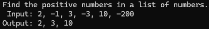

Write a program in C# Sharp to find the positive numbers from a list of numbers using where conditions in LINQ Query.
```
Input: { 2, -1, 3, -3, 10, -200}
Expected output: {2, 3, 10}
```
---
### Code Output

